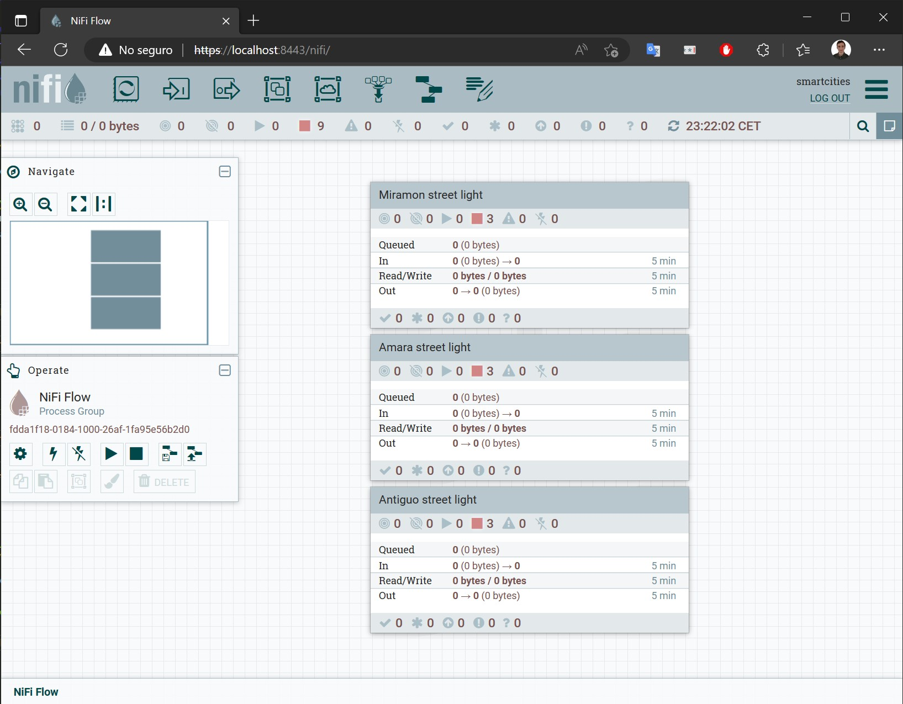
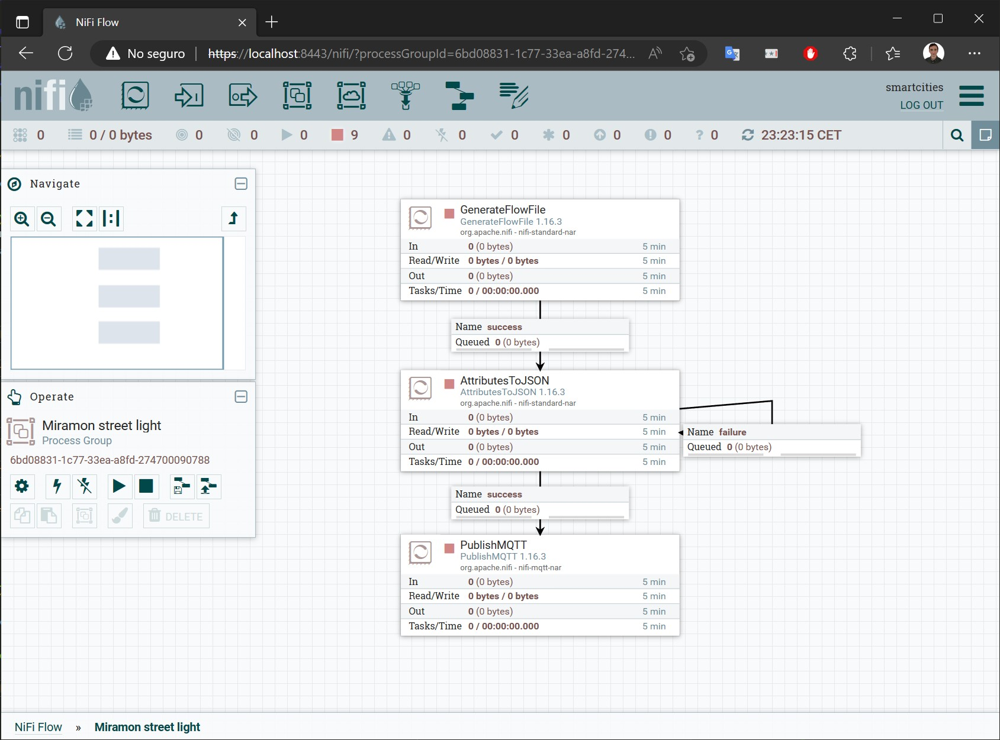
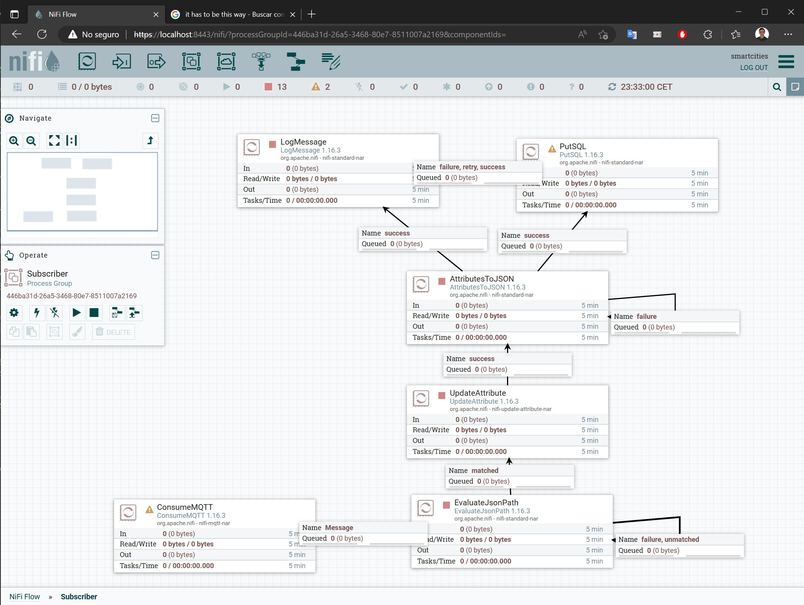

# Smart cities

## Description
This is the GitHub repository for the final practice of Smart cities. The authors of the practice are [@bsunsundegi](https://github.com/bsunsundegi), [@jmuguruza](https://github.com/jmuguruza), [@acamher](https://github.com/acamher) and [@carlostoca1](https://github.com/carlostoca1).

**Project Status:** `in progress`

The Smart City network will be like the one shown below:


## Content index
During the implementation the following steps will be covered:

- [Smart cities](#smart-cities)
  - [Description](#description)
  - [Content index](#content-index)
  - [Configure global structure](#configure-global-structure)
    - [Initiate PC server and gateway](#initiate-pc-server-and-gateway)
    - [Software installation in PC server and gateway](#software-installation-in-pc-server-and-gateway)
    - [Configure iptables in PC server and gateway](#configure-iptables-in-pc-server-and-gateway)
    - [Configure QoS in PC server and gateway](#configure-qos-in-pc-server-and-gateway)
  - [WiFi access point](#wifi-access-point)
    - [Configure dnsmasq](#configure-dnsmasq)
    - [Configure hostapd](#configure-hostapd)
    - [WiFi service start](#wifi-service-start)
  - [Webpage](#webpage)
    - [Configure apache server](#configure-apache-server)
    - [Design simple webpage](#design-simple-webpage)
  - [Video surveillance](#video-surveillance)
    - [Configure RaspberryPi](#configure-raspberrypi)
    - [Install camera](#install-camera)
    - [Configure routing in PC gateway](#configure-routing-in-pc-gateway)
    - [Configure streaming reception in PC gateway](#configure-streaming-reception-in-pc-gateway)
    - [Configure streaming reception in PC server](#configure-streaming-reception-in-pc-server)
    - [Improve webpage](#improve-webpage)
    - [Test system and troubleshooting](#test-system-and-troubleshooting)
    - [Security improvement](#security-improvement)
  - [Sensor system](#sensor-system)
    - [Configure RaspberryPi](#configure-raspberrypi-1)
    - [Install sensors software](#install-sensors-software)
    - [Configure apache MiNiFi](#configure-apache-minifi)
    - [NiFi program](#nifi-program)
    - [Configure routing in PC gateway](#configure-routing-in-pc-gateway-1)
    - [Configure database](#configure-database)
    - [Improve webpage](#improve-webpage-1)
    - [Test system and troubleshooting](#test-system-and-troubleshooting-1)
    - [Security improvement](#security-improvement-1)
  - [Suggestion box](#suggestion-box)

## Configure global structure
<details>
<summary>Open to see details</summary>
  
### Initiate PC server and gateway

The operating system chosen for both the PC server and the PC gateway is Ubuntu 22.04. Each one of these PCs are executed in different virtual machines.
For the case of the PC server, Apache Web Server is installed to host the webpage that later will be used.

### Software installation in PC server and gateway

After launching the virtual machines for server and gateway, some software kit has to be installed. It is recommended to use the two scripts that are located in `~/1-Configure-global-structure`, named `gateway_software.sh` and `server_software.sh`. Execute them and accept when asked in the installation process.

### Configure iptables in PC server and gateway

Afterwards, the iptables are configured. In the gateway side the 5 interfaces are defined (server, webcam, sensors, WiFi and Internet), each one with a given IP. Then, some iptable rules are added, according to each of the 5 services. The file is again in the first folder with the name `gateway_iptables.sh`. On the other side, the iptables configuration file for the server will be `server_iptables.sh`; run both scripts and verify that there are no errors.

### Configure QoS in PC server and gateway

Lastly, a QoS configuration is made, to distribute the available bandwith between the different processes. In the gateway side, the uplink traffic to the server is limited to 1 Mbps, while the downlink is limited to 5 Mbps. Regarding the server, the downlink traffic is 20 Mbps. The file `gateway_qdisc.sh` was already executed when running `gateway_iptables.sh`, so executing `server_qdisc.sh` is enough. Verify, once again, that you do not receive any error.
    
</details>
  
## WiFi access point
<details>
<summary>Open to see details</summary>
  
### Configure dnsmasq

The first step of the WiFi access point will be configuring a DNS and DHCP server; for that purpose dnsmasq will be used. In the configuration file the interface is set to `wlan`, binding interface is enabled and a DHCP range is defined according to the general network scheme. Then, go to`~/2-WiFi-access-point` and execute the file `dnsmasq.conf`.
  
### Configure hostapd
  
Second, the access point needs to be implemented. Parameters like channel, password, interface are defined in the configuration file. Now again, go to `~/2-WiFi-access-point` and execute the file `hostapd.conf`.
  
### WiFi service start

Finally, when both the DNS/DHCP and the access point have been configured, they need to be started. Optionally, use from the same directory the script `wifi.sh`, that will do this task automatically when executed.

</details>

## Webpage
<details>
<summary>Open to see details</summary>
  
### Configure apache server

The following guide was used to install the Apache Web Server: [Installing Apache Web Server](https://www.digitalocean.com/community/tutorials/how-to-install-the-apache-web-server-on-ubuntu-22-04)

In the next picture it can bee seen that the web server has been well deployed


### Design simple webpage
If the admin wants to see data such as video surveillance, sensor data or the suggestions submitted by the users in the suggestion box, the webpage deployed for that would look like the following one:


This page has three buttons. Each button corresponds to each one of the 3 possible types of data. If the admin would like to return back to the main page, it would be possible through the button that appears on screen when whichever button is pressed.
</details>

## Video surveillance
<details>
<summary>Open to see details</summary>
  
### Configure RaspberryPi
At first, the RaspberryPi only has the Raspbian image and the operating system generated by the image. Just by connecting it through HDMI will not work. So in order for this to work, we have to do the following steps.

1. Unplug the RaspberryPi and extract the SD Card.

2. If your computer does not have a MicroSD Card Slot, plug the MicroSD Card to the PC through a MicroSD to USB device.

3. Find the file named 'config.txt' and open it. To be able to send images through HDMI some parameters of this file will have to be modified.


This files are commented with a '#' so just removing the '#' will be enough. The parameters that have to be uncommented are:
  - `hdmi_safe = 1`
  - `hdmi_force_hotplug = 1`
  - `hdmi_drive = 2`
  
  


Once this parameters are uncommented, the RaspberryPi HDMI will work.

4. Remove the MicroSD Card from the PC and plug it back to the RaspberryPi.  

5. Switch on the RaspberryPi and connect it to any monitor through HDMI.

The RaspberryPi Boot Image should appear on the screen.


Now, the next step will be to configure Raspbian, the operating system of the RaspberryPi. This configuration is easy, choose the language and region you are the most comfortable with and connect it to a Wi-Fi network if possible, this way the Raspberry can update the software to the latest release.

After this is done, the Raspberry will be configured and ready to use. If everything has been done well, the Desktop should be seen.


### Install camera
First of all, to make this task easier, unplug the RaspberryPi and go to the config.txt file. Find the parameter camera_auto_detect=1 and uncomment it. This will make the RaspberryPi autodetect the camera without needing additional software or hardware.

  
To test if the camera works, we install a simple camera software called guvcview.
  
For this, open a terminal and execute the following command:
 
  `sudo apt-get update`
  
  `sudo apt-get upgrade`
  
  `sudo apt-get install guvcview`
  
  `sudo usermod -G video pi`
  
  `sudo modprobe uvcvideo`
  
  `reboot`
  
After rebooting the device, a new program should appear in the "sound and video" tab in the main menu called "guvcview".
  

  
Open it and the camera should appear automatically
  


To change the IP address of the raspberry, the configuration file `/etc/dhcpcd.conf` has to be modified so anytime the device is switched on it is configured by default and there is no need to execute any additional lines everytime.

Now, to get the video from the webcam, mjpg streamer must be installed. For this, open a terminal and enter the following commands:

`sudo apt update`

`sudo apt install snapd`

`sudo reboot`

`sudo snap install core`

`sudo snap install mjpg-streamer`

This will install a program that detects USB webcams and also serves as a streaming server.

To start streaming video, a terminal must be opened in the Raspberry to enter the following command:

`mjpg_streamer`

To modify the parameters of the video such as the frame rate, the resolution and the port through which the video will exit the Raspberry, execute the following file that has to be in the folder installed by the `sudo snap install mjpg-streamer` command:

`./start.sh`

The file `start.sh` is in the folder 4-Video-surveillance.

To view the video, the html file that corresponds to the video surveillance must be modified. The line that should be added is the following one:

``

You should be able to see the video in real time.

### Configure routing in PC gateway
### Configure streaming reception in PC gateway
### Configure streaming reception in PC server
### Improve webpage
### Test system and troubleshooting
When connecting the Raspberry Pi to a PC monitor, it did not work using display port nor VGA, just using a HDMI-HDMI connection between them. In addition, in the 'config.txt' file the screen resolution needs to be changed, accordingly to monitor's resolution, in the parameter hdmi_mode; in our case a resolution of 640x480 was used.
### Security improvement

</details>

## Sensor system
A Raspberry Pi simulates multiple data sensors that will be send to the PC Server using MQTT. The PC Server saves the new data in a MySQL database and the webpage can get the data from there.
<details>
<summary>Open to see details</summary>
  
### Configure RaspberryPi
The OS of the Raspberry Pi was downloaded from the official web page and was installed using a Windows PC with a USB, writting the OS on a memory card. Then the memory is inserted on the raspberry and turned it on.

The next step is to configure the routing by inserting the IP commented on the scheme.

### Install sensors software
For the software it is necessary to install java with the order `sudo apt install java-8-openjdk`. After that it is necessary to set the global variable using `export JAVA_HOME=/usr/lib/jvm/java-8-openjdk`, this will help minifi when running.
It is also required an MQTT package with `sudo apt install mosquitto-clients`. This allowed us to test the program while running and setting the conections.

### Configure apache MiNiFi
MiNiFi is a lighter version of NiFi that consumes much less resources. This allows the Raspberry Pi to execute some flows created on NiFi. For downloading MiNiFi: `wget https://dlcdn.apache.org/nifi/1.19.1/minifi-1.19.1-bin.zip`, after decompressing the program it is necessary to import the `config.yml` file.
NiFi exports templates in format `xml`, but MiNiFi needs a `yml` and for that it is necessary to also install MiNiFi toolkit with `wget https://dlcdn.apache.org/nifi/1.19.1/minifi-toolkit-1.19.1-bin.zip` and decompressing that zip to. Once the toolkit is ready the command while staying on the main folder of the program on root user: `./bin/config.sh transform <input_file.xml> <output_file.yml>`. The last step is the move the new `yml` file to the folder `${minifi_path}/conf/config.yml`.

With the program ready to be executed: `./bin/minifi.sh start` being on the root folder of the minifi download.

### NiFi program
The MQTT publisher and subscriber were created using NiFi.

Publisher works with three street lights sending data over MQTT to the Server PC using Gateway PC path.


Each process has the same structure, using three blocks conforming a JSON which will be sent to the server. The JSON structure is represented in `5-Sensos-system/estructure.json`.


This proccess saves the data to a MySQL database but during the proccess it extract the JSON data and updates the DATETIME atribute to a `YYYY-MM-DD HH:mm:ss` format.


### Configure routing in PC gateway

The PC gateway was already configured to allow routing throwards the machine. It also has installed the mosquitto package because the PC is the broker which join the publishers and the subscribers of the protocol.

### Configure database
The database was MySQL database. The install is `sudo apt install mysql-server` and the access to the DB is `sudo mysql -u smartcities -p`.
The database was made following the next structure:
```sql
CREATE TABLE SENSORS (
  REGISTERID INT(10) PRIMARY KEY AUTO_INCREMENT,
  SENSORID VARCHAR(25),
  LATITUDE DECIMAL(8, 6),
  LONGITUDE DECIMAL(9, 6),
  DATETIME DATETIME,
  TEMPERATURE INT(3),
  ENERGY INT(3),
  LIGHTSTATUS BIT(1)
);
```

### Improve webpage
In the webpage was added a php file that makes a query to the database for knowing the IDs of the sensors inside the database. Then other php file do another query which shows the data from the last 2 weeks in order from most recent to the oldest.

### Test system and troubleshooting

During the testing ocurred multiple errors that were solved as:

1. MiNiFi needs to have java-8-openjdk installed, the latest version (java-11-openjdk) doesn't work. That generates errors during the transformation from `xml` to `yml`.
2. Once the template is transformed and correctly moved to the path, the aplication needs an extra package for sending the MQTT messages, that package is `nifi-mqtt-nar-X.X.X.nar`.
3. Sometimes the connections between Raspberry Pi - Gateway and Gateway - Server fails and need be execute the script again.

### Security improvement

</details>

## Suggestion box
<details>
<summary>Open to see details</summary>
</details>
